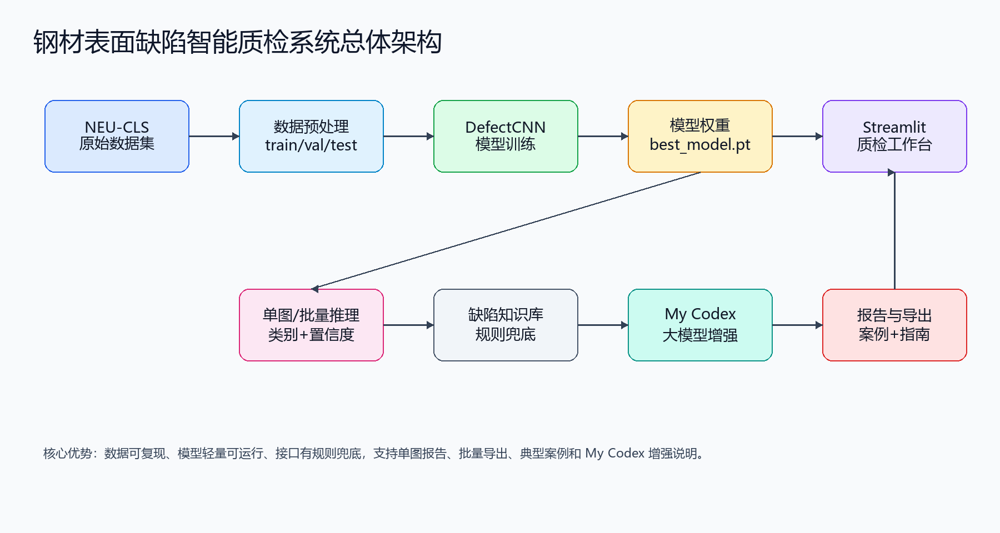
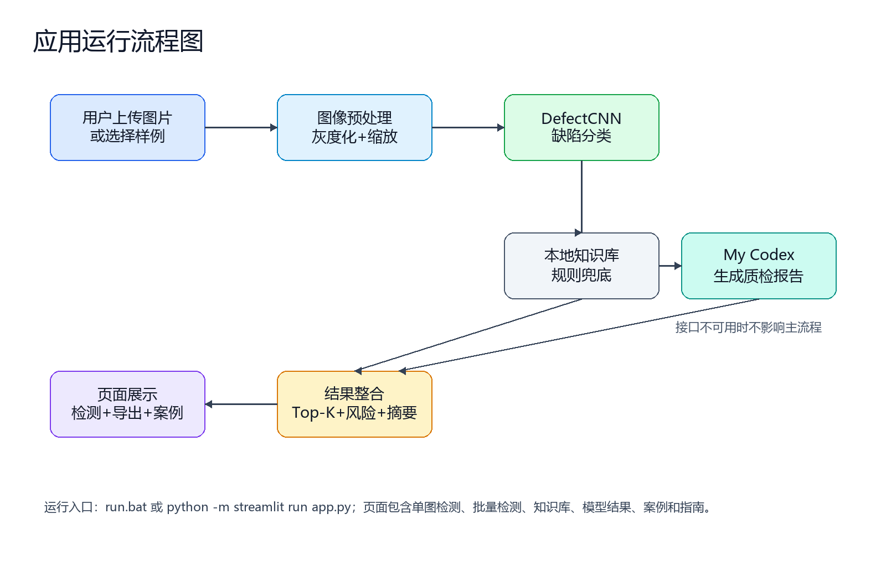
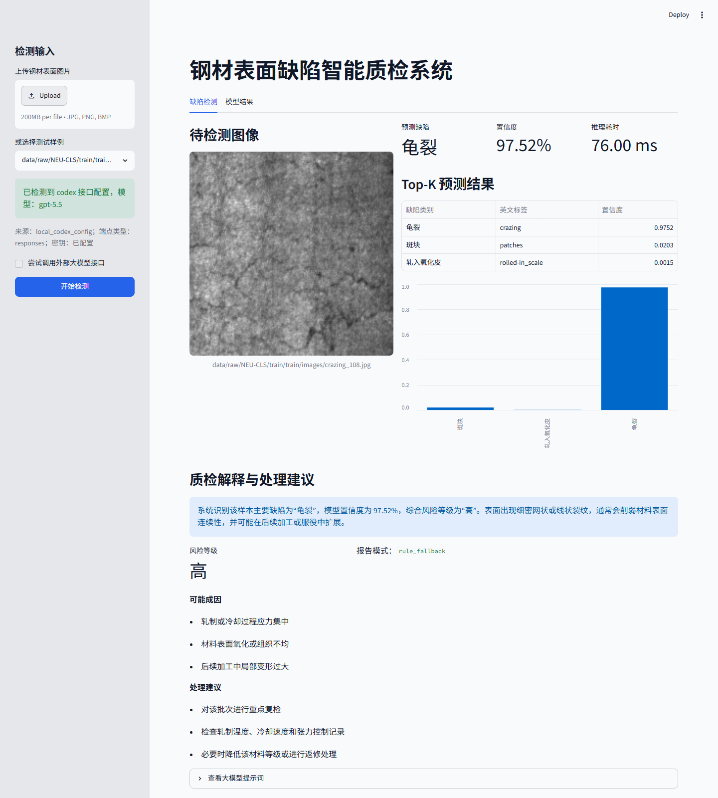
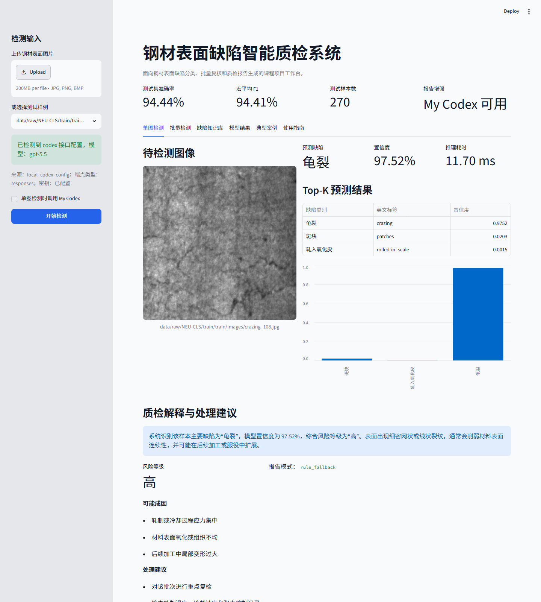
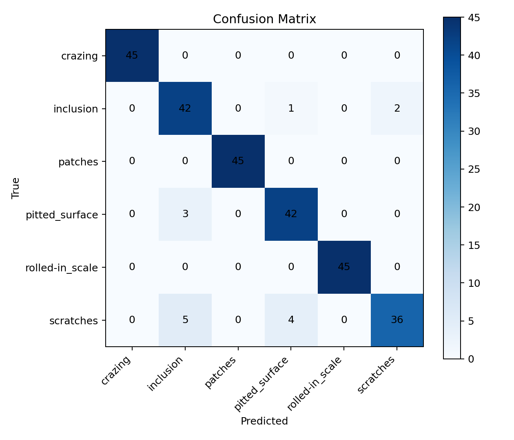
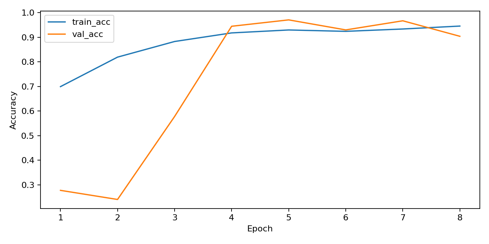
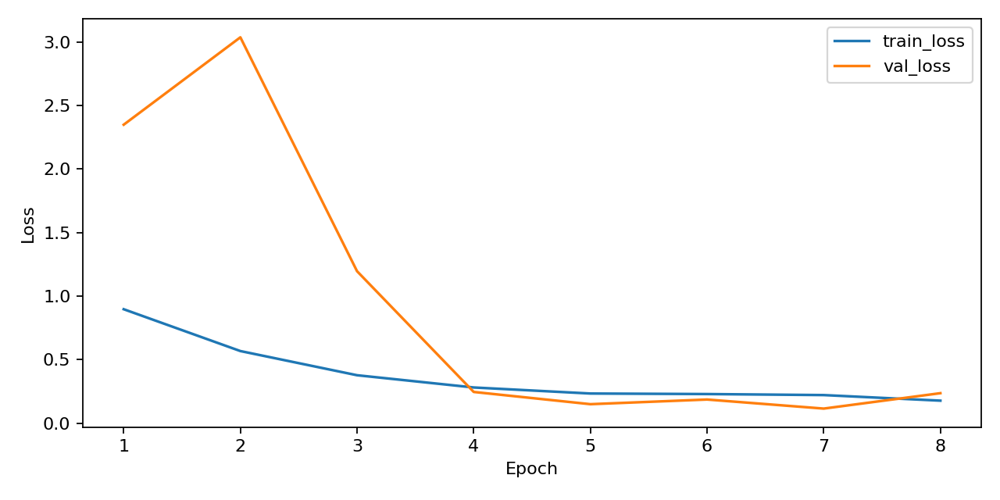

# 钢材表面缺陷智能质检与大模型诊断报告系统

课程名称：人工智能基础 B

项目名称：钢材表面缺陷智能质检与大模型诊断报告系统

团队成员：待补充

提交日期：待补充

## 摘要

钢材表面质量检测是制造业生产过程中的重要环节。传统人工质检依赖经验判断，存在效率低、主观性强、漏检风险高等问题。针对这一问题，本项目设计并实现了一个钢材表面缺陷智能质检系统。系统以 NEU-CLS 钢材表面缺陷数据集为基础，使用 Python 和 PyTorch 构建轻量卷积神经网络，对龟裂、夹杂、斑块、麻点表面、轧入氧化皮和划痕六类典型缺陷进行自动识别。在模型输出缺陷类别和置信度后，系统结合本地缺陷知识库和可选的大模型接口生成缺陷解释、风险等级、可能成因和处理建议，并通过 Streamlit 页面展示检测结果。实验结果表明，模型在测试集上取得 94.44% 的准确率，宏平均 F1 值为 94.41%，能够较稳定地区分主要钢材表面缺陷类型。本项目形成了从数据准备、模型训练、模型推理、质检解释到界面展示的完整工程闭环。

关键词：钢材表面缺陷；深度学习；卷积神经网络；智能质检；大模型；Streamlit

## 1. 项目概述

### 1.1 项目背景

钢材广泛应用于建筑结构、机械制造、交通装备、电力设备和工业生产线等场景。钢材表面质量直接影响后续加工、涂装、焊接和服役可靠性。在热轧、冷轧、除鳞、酸洗、输送和卷曲等生产环节中，钢材表面可能出现龟裂、夹杂、斑块、麻点、氧化皮轧入和划痕等缺陷。这些缺陷如果没有及时发现，可能导致产品降级、返工、投诉甚至安全隐患。

传统质检方式主要依赖人工目视检查或简单图像处理算法。人工检查容易受到疲劳、经验差异和现场环境影响，检测结果不够稳定；传统图像处理方法通常依赖阈值、边缘和纹理规则，对复杂光照、表面纹理变化和多类型缺陷适应能力有限。随着深度学习和大模型技术的发展，利用卷积神经网络自动识别缺陷，并使用大模型生成可读的质检解释，能够提升质检效率和报告规范性。

### 1.2 项目目标

本项目目标是构建一个可运行的钢材表面缺陷智能质检系统，实现以下功能：

- 对钢材表面图片进行六类缺陷识别。
- 输出模型预测类别、中文类别、置信度和推理耗时。
- 根据识别结果生成缺陷解释、可能成因、风险等级和处理建议。
- 提供可视化页面，支持上传图片或选择测试样例进行检测。
- 展示模型训练结果，包括准确率、精确率、召回率、F1 值、混淆矩阵和训练曲线。

本项目设定的量化目标为：测试集准确率不低于 90%，宏平均 F1 值不低于 90%，单张图片推理耗时控制在毫秒级或低秒级，系统可通过一键脚本启动。

### 1.3 团队分工

| 成员 | 学号 | 主要职责 |
| --- | --- | --- |
| 待补充 | 待补充 | 选题统筹、报告撰写、成果整合 |
| 待补充 | 待补充 | 数据处理、模型训练、指标统计 |
| 待补充 | 待补充 | 系统界面、大模型模块、测试整理 |

## 2. 总体方案设计

### 2.1 系统总体流程

系统采用“图像输入 -> 深度学习识别 -> 质检解释生成 -> 结果可视化输出”的流程。用户在页面上传钢材表面图像或选择测试集样例后，系统调用已训练的卷积神经网络模型进行分类预测，得到缺陷类别、置信度和 Top-K 预测结果。随后，质检解释模块根据预测结果查询缺陷知识库，生成风险等级、可能成因和处理建议；如果本地配置了 Codex 或 OpenAI 兼容接口，系统可进一步调用大模型生成更自然的质检报告。

```text
NEU-CLS 数据集
-> 数据预处理与 train/val/test 划分
-> DefectCNN 模型训练
-> 单图推理
-> 规则知识库/大模型生成质检报告
-> Streamlit 页面展示
```



### 2.2 技术选型

项目使用 Python 作为主开发语言。深度学习部分采用 PyTorch 实现，因为 PyTorch 具备动态图机制、调试方便、生态成熟，适合课程项目快速训练和验证。考虑到本项目需要在普通 CPU 环境中运行，模型没有依赖大型预训练网络，而是设计了轻量卷积神经网络 `DefectCNN`，避免额外安装 `torchvision`，降低环境配置风险。界面部分使用 Streamlit，实现上传图片、结果展示和图表展示，代码简洁且便于演示。

大模型模块采用“本地规则知识库兜底 + 外部接口可选增强”的结构。默认情况下，系统不依赖网络和密钥即可生成稳定报告；如果配置了 `CODEX_API_URL`、`CODEX_MODEL` 等环境变量，或本机存在 Codex 配置文件，系统可以调用 My Codex 或其他 OpenAI 兼容接口生成自然语言报告。本项目当前已成功识别本机 My Codex 配置，接口来源为 `https://api.9e.lv/v1`，实际端点为 Responses API，模型为 `gpt-5.5`。该设计保证了项目在作业提交环境下的稳定性，也体现了大模型辅助工业质检报告生成的能力。

### 2.3 模块划分

| 模块 | 文件 | 功能 |
| --- | --- | --- |
| 数据模块 | `data/preprocess_neu_cls.py` | 扫描原始图片，生成分类标签，划分训练集、验证集和测试集 |
| 模型模块 | `models/neu_cls_model.py` | 定义轻量 CNN 缺陷分类模型 |
| 训练模块 | `models/train_neu_cls.py` | 训练模型，保存权重、指标、曲线和混淆矩阵 |
| 推理模块 | `models/infer_neu_cls.py` | 输入单张图片，输出缺陷类别、置信度和推理耗时 |
| 大模型模块 | `llm/quality_report.py` | 生成缺陷解释、风险等级、可能成因和处理建议 |
| 界面模块 | `app.py` | Streamlit 页面，整合上传、检测、报告和模型结果展示 |

## 3. 详细实现过程

### 3.1 数据模块

本项目使用 NEU-CLS 钢材表面缺陷数据集。数据集包含 1800 张钢材表面缺陷图像，共 6 个类别，每类 300 张。类别包括 `crazing`、`inclusion`、`patches`、`pitted_surface`、`rolled-in_scale` 和 `scratches`，对应中文含义分别为龟裂、夹杂、斑块、麻点表面、轧入氧化皮和划痕。

原始数据中包含图片和标注文件。本项目第一版将其作为图像分类任务处理，利用文件名前缀生成分类标签。为了获得更稳定的评估结果，项目没有直接使用原始数据划分，而是按类别重新划分训练集、验证集和测试集，比例为 70%、15%、15%。最终训练集包含 1260 张图片，验证集包含 270 张图片，测试集包含 270 张图片，每个类别均按 210/45/45 划分，保证类别分布均衡。

预处理脚本输出 `train.csv`、`val.csv`、`test.csv`、`class_to_idx.json` 和 `split_summary.csv` 等文件，训练脚本直接读取这些清单，不复制原始图片，保证数据处理过程清晰可复现。

### 3.2 模型模块

模型采用轻量卷积神经网络 `DefectCNN`。网络输入为单通道灰度图像，经过多层卷积、批归一化、ReLU 激活和池化操作提取缺陷纹理特征，最后通过全局自适应平均池化和全连接层输出 6 类缺陷概率。该模型结构较轻，适合 CPU 环境训练和推理，同时能够学习钢材表面纹理中的局部缺陷模式。

训练参数如下：

| 参数 | 数值 |
| --- | --- |
| 模型 | DefectCNN |
| 输入尺寸 | 160 x 160 |
| Epoch | 8 |
| Batch size | 64 |
| 学习率 | 0.001 |
| 优化器 | Adam |
| 损失函数 | CrossEntropyLoss |
| 训练设备 | CPU |

训练过程中保存验证集准确率最高的模型权重 `best_model.pt`。同时输出训练曲线、准确率曲线、混淆矩阵和分类报告，为报告分析提供依据。

### 3.3 大模型模块

大模型模块位于 `llm/quality_report.py`。模块首先维护了六类缺陷的知识库，包括缺陷中文名称、基础风险等级、缺陷描述、可能成因和处理建议。当模型输出缺陷类别和置信度后，系统根据知识库生成稳定的质检报告。

为了体现大模型应用能力，模块还支持本机 My Codex 和 OpenAI 兼容接口。用户可通过环境变量配置 `CODEX_API_URL`、`CODEX_MODEL` 和 `CODEX_API_KEY`，也可直接读取本机 `%USERPROFILE%\.codex\config.toml` 与 `%USERPROFILE%\.codex\auth.json`。当前项目检测到的本机配置为 `base_url = "https://api.9e.lv/v1"`、`wire_api = "responses"`、`model = "gpt-5.5"`。系统会根据预测结果构造提示词，让大模型以质检工程师身份生成缺陷解释报告。如果外部接口不可用，系统会自动回退到本地规则报告，避免影响主流程运行。

### 3.4 界面模块

界面使用 Streamlit 开发，当前已升级为“质检工作台”形式。页面包含“单图检测”“批量检测”“缺陷知识库”“模型结果”“典型案例”和“使用指南”六个标签页。在单图检测页，用户可以上传钢材表面图片，也可以从测试集中选择样例；点击检测后，系统展示待检测图片、预测缺陷类别、置信度、推理耗时、Top-K 预测结果、风险等级、可能成因和处理建议，并支持下载单图 Markdown 质检报告。在批量检测页，系统可以对测试集样本或多张上传图片进行快速复核，输出批量明细表、类别分布、平均置信度、高风险样本数，并支持导出 CSV 明细和 Markdown 摘要。在缺陷知识库页，系统集中展示六类缺陷的说明、成因和处理建议；在模型结果页，系统展示测试准确率、宏平均精确率、宏平均召回率、宏平均 F1、混淆矩阵、准确率曲线和损失曲线；在典型案例和使用指南页，系统提供课堂演示路径、工程应用案例和常见问题说明。







## 4. 测试与结果分析

### 4.1 模型性能结果

第一版模型训练结果如下：

| 指标 | 结果 |
| --- | ---: |
| 验证集最佳准确率 | 97.04% |
| 测试集准确率 | 94.44% |
| 测试集宏平均精确率 | 94.68% |
| 测试集宏平均召回率 | 94.44% |
| 测试集宏平均 F1 | 94.41% |
| 训练耗时 | 144.76 秒 |

从结果看，模型已经超过预设的 90% 准确率和 90% F1 值目标，说明轻量卷积网络能够较好地区分六种典型钢材表面缺陷。模型在单张测试图片 `crazing_1.jpg` 上预测为龟裂，置信度为 99.65%，推理耗时约 8-10 ms，满足交互式检测需求。另使用 `models/batch_infer_neu_cls.py` 对 270 张测试集图片进行逐样本批量推理，得到正确 255 张、准确率 94.44%，与训练脚本评估结果一致。

各类别测试结果如下：

| 类别 | 精确率 | 召回率 | F1 值 | 样本数 |
| --- | ---: | ---: | ---: | ---: |
| 龟裂 | 100.00% | 100.00% | 100.00% | 45 |
| 夹杂 | 84.00% | 93.33% | 88.42% | 45 |
| 斑块 | 100.00% | 100.00% | 100.00% | 45 |
| 麻点表面 | 89.36% | 93.33% | 91.30% | 45 |
| 轧入氧化皮 | 100.00% | 100.00% | 100.00% | 45 |
| 划痕 | 94.74% | 80.00% | 86.75% | 45 |







### 4.2 功能测试

系统已验证以下功能：

- 数据预处理脚本可生成训练、验证和测试清单。
- 训练脚本可保存模型权重、指标、曲线和混淆矩阵。
- 推理脚本可对单张图片输出类别、置信度和推理耗时。
- 质检解释模块可生成风险等级、可能成因和处理建议。
- 外部接口未配置时，系统能自动使用本地规则报告。
- My Codex 接口已通过本机 `https://api.9e.lv/v1/responses` 真实调用验证，报告模式为 `llm_enhanced`。
- Codex/OpenAI 兼容接口调用逻辑同时保留本地 mock 验证路径，便于无网络环境下测试接口分支。
- Streamlit 页面可正常启动，本地访问地址为 `http://localhost:8501`。
- 页面已支持单图 Markdown 报告下载、批量 CSV 明细下载、批量 Markdown 摘要下载。
- 页面已补充缺陷知识库、典型案例和网页内使用指南，便于课堂展示和后续视频录制。

### 4.3 稳定性分析

系统设计中重点考虑了运行稳定性。首先，数据划分使用固定随机种子，保证实验结果可复现。其次，模型结构不依赖额外预训练权重，避免网络下载失败。第三，大模型模块使用规则知识库作为兜底，不会因为 API 密钥缺失或外部服务不可用导致项目无法运行。最后，`run.bat` 设置了 UTF-8 控制台代码页并通过 `python -m streamlit run app.py` 启动页面，降低中文乱码和命令错误风险。

## 5. 总结与展望

本项目围绕钢材表面缺陷智能质检场景，完成了从数据准备、模型训练、指标评估、缺陷推理、大模型解释到界面展示的完整闭环。实验结果表明，第一版轻量 CNN 模型已经能够在 NEU-CLS 测试集上取得 94.44% 的准确率和 94.41% 的宏平均 F1 值，具备较好的缺陷识别能力。系统通过本地知识库和可选大模型接口生成质检解释，使模型输出更容易被质检人员理解和使用。相比基础分类演示，当前版本进一步加入了批量检测、结果导出、缺陷知识库、典型案例和网页内使用指南，使作品更接近真实质检工作台，也更便于课程展示和答辩说明。

当前项目仍有进一步优化空间。第一，模型可以尝试 ResNet、MobileNet 或 EfficientNet 等更强的结构，提高复杂样本识别能力。第二，可以利用原始标签文件中的坐标信息，将任务从分类扩展为缺陷检测，实现缺陷位置框选。第三，可以扩充缺陷知识库，将更多工艺参数、质量标准和维修策略纳入报告生成过程。第四，可以继续增强批量检测结果分析，例如加入批次级异常阈值、历史趋势对比和质检日志管理，使系统更接近真实生产线质检软件。

总体来看，本项目较好地体现了人工智能基础课程中 Python 编程、深度学习建模、大模型应用和工程实践结合的要求。
