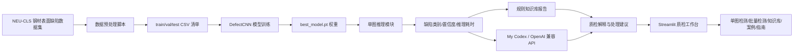
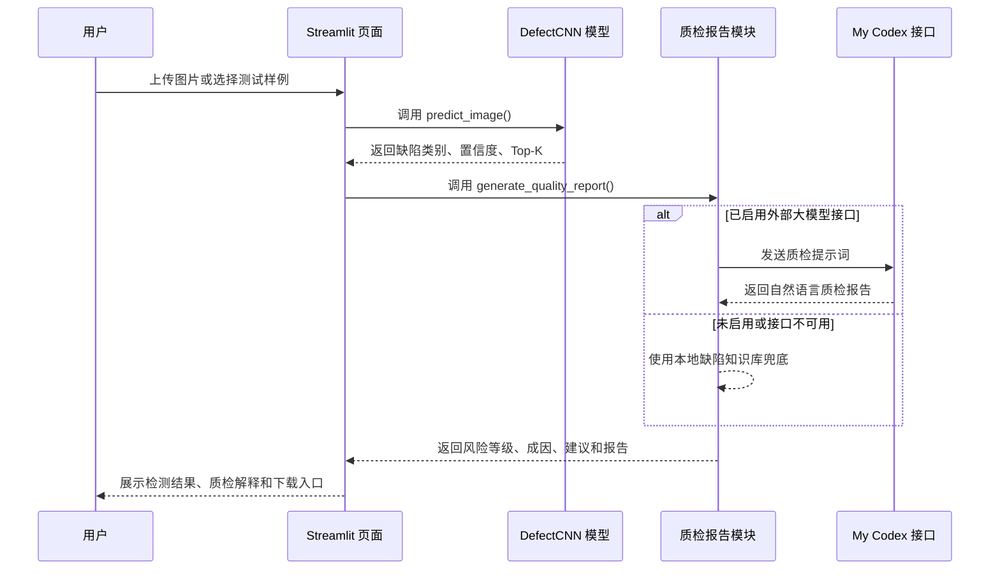
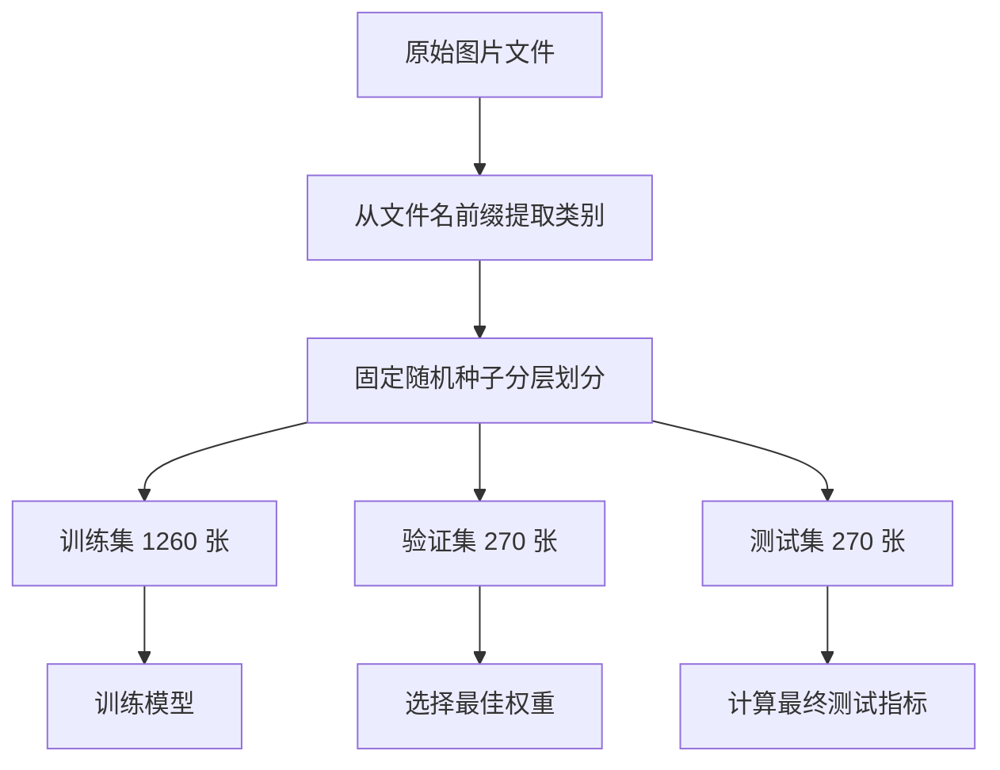

# 系统架构与流程图

## 总体架构



## 应用运行流程



## 数据处理流程



## 截图材料

有效页面截图：

```text
05_补充材料/运行截图/streamlit_detection_sample.png
```

## 当前页面模块

- 单图检测：上传或选择样例，生成单图质检报告。
- 批量检测：批量推理、统计分布、导出 CSV 与 Markdown 摘要。
- 缺陷知识库：展示六类缺陷的成因和处理建议。
- 模型结果：展示准确率、F1、混淆矩阵和训练曲线。
- 典型案例：提供工程场景演示路径。
- 使用指南：提供网页内操作说明和常见问题。
